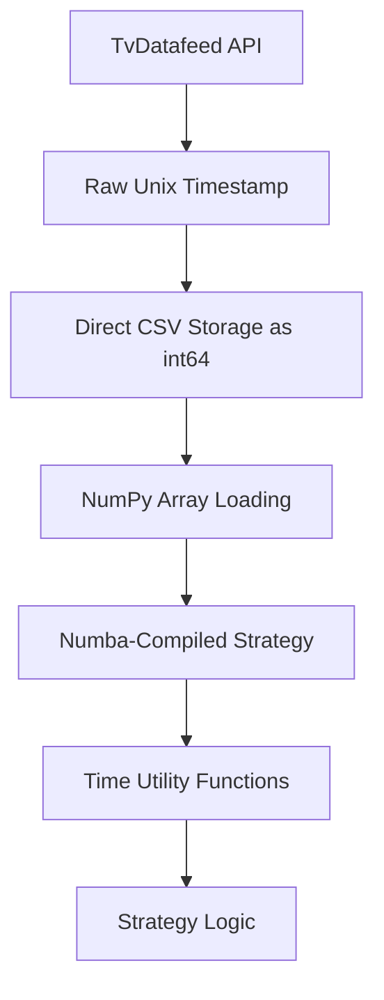

# Design Document: Numba-Optimized Datetime Handling

## Overview

This design implements a hybrid approach for datetime handling that maximizes numba performance by storing raw Unix timestamps as int64 values while providing fast utility functions for time component extraction. The solution eliminates string conversions entirely from the data processing pipeline and provides numba-compiled utility functions for time-based operations.

## Architecture

### Core Design Principles

1. **Raw Storage**: Store timestamps as Unix epoch integers (int64) for maximum performance
2. **Utility Functions**: Provide numba-compiled functions for time component extraction
3. **Single Column**: Use one timestamp column instead of separate date/time columns
4. **Zero String Operations**: Eliminate all string datetime conversions from data processing
5. **Numba Compatibility**: Ensure all timestamp operations are numba-compilable

### Data Flow Architecture



## Components and Interfaces

### 1. Updated DataTuple Structure

**Current Structure:**
```python
DataTuple: TypeAlias = Tuple[str, NDArray, NDArray, NDArray, NDArray, NDArray, NDArray, NDArray]
# (symbol, dates, times, opens, highs, lows, closes, volume)
```

**New Structure:**
```python
DataTuple: TypeAlias = Tuple[str, NDArray, NDArray, NDArray, NDArray, NDArray, NDArray]
# (symbol, timestamps, opens, highs, lows, closes, volume)
```

### 2. CSV Format Changes

**Current Format:**
```csv
date,time,Open,High,Low,Close,Volume
2024-01-01,09:15:00,100.0,101.0,99.5,100.5,1000
```

**New Format:**
```csv
timestamp,Open,High,Low,Close,Volume
1704096900,100.0,101.0,99.5,100.5,1000
```

### 3. Numba Time Utility Functions

```python
@numba.jit(nopython=True)
def extract_hour(timestamp: int) -> int:
    """Extract hour (0-23) from Unix timestamp."""
    
@numba.jit(nopython=True)
def extract_minute(timestamp: int) -> int:
    """Extract minute (0-59) from Unix timestamp."""
    
@numba.jit(nopython=True)
def extract_second(timestamp: int) -> int:
    """Extract second (0-59) from Unix timestamp."""
    
@numba.jit(nopython=True)
def extract_day_of_week(timestamp: int) -> int:
    """Extract day of week (0=Monday, 6=Sunday) from Unix timestamp."""
    
@numba.jit(nopython=True)
def is_in_time_range(timestamp: int, start_hour: int, start_minute: int, 
                     end_hour: int, end_minute: int) -> bool:
    """Check if timestamp falls within specified time range."""
```

### 4. Updated Data Processing Functions

#### Modified `process_symbol_data`
- Remove datetime string conversions
- Store raw Unix timestamps directly
- Eliminate timezone conversion during storage
- Use single timestamp column format

#### Modified `read_from_csv`
- Load timestamps as int64 numpy arrays
- Remove date/time parsing logic
- Return updated DataTuple structure
- Ensure numba compatibility

#### Modified `hist_download`
- Maintain timezone handling only during download
- Store raw timestamps without conversion
- Use new CSV header format
- Preserve original timestamp precision

## Data Models

### Timestamp Representation

**Storage Format:**
- Type: `np.int64`
- Unit: Seconds since Unix epoch (1970-01-01 00:00:00 UTC)
- Range: Supports dates from 1970 to 2038+ (64-bit)
- Precision: 1-second resolution

**Memory Layout:**
```python
# Before (2 arrays):
dates: np.ndarray[datetime.date]     # 8 bytes per element + object overhead
times: np.ndarray[datetime.time]     # 8 bytes per element + object overhead

# After (1 array):
timestamps: np.ndarray[np.int64]     # 8 bytes per element, no overhead
```

### Strategy Data Access Pattern

```python
# Strategy receives DataTuple with timestamps
def run(self, data: DataTuple, **kwargs) -> NDArray:
    symbol, timestamps, opens, highs, lows, closes, volume = data
    
    # Use utility functions for time-based logic
    hours = extract_hour_vectorized(timestamps)
    market_hours_mask = (hours >= 9) & (hours < 16)
    
    # Apply strategy logic with time filtering
    filtered_closes = closes[market_hours_mask]
    # ... strategy implementation
```

## Research and Implementation Context

### Numba Datetime Limitations

Research into numba's datetime support reveals significant limitations:
- No native support for datetime objects in nopython mode
- String operations are not supported in numba
- Complex timezone calculations are not numba-compatible
- Performance overhead from datetime object creation

### Unix Timestamp Advantages

1. **Performance**: Integer arithmetic is fastest in numba
2. **Memory**: Single int64 vs two object arrays
3. **Compatibility**: Full numba nopython support
4. **Simplicity**: No complex datetime library dependencies

### Time Extraction Algorithms

The utility functions will use mathematical operations for time extraction:

```python
# Hour extraction (0-23)
def extract_hour(timestamp: int) -> int:
    # Convert to local time offset and extract hour
    local_timestamp = timestamp + TIMEZONE_OFFSET_SECONDS
    seconds_in_day = local_timestamp % 86400  # 86400 = 24 * 60 * 60
    return seconds_in_day // 3600  # 3600 = 60 * 60

# Day of week extraction (0=Monday, 6=Sunday)
def extract_day_of_week(timestamp: int) -> int:
    # Unix epoch started on Thursday (1970-01-01)
    # Adjust to make Monday = 0
    days_since_epoch = timestamp // 86400
    return (days_since_epoch + 3) % 7  # +3 adjusts Thursday to Monday=0
```

Now I need to use the prework tool to analyze the acceptance criteria before writing the Correctness Properties section.

<function_calls>
<invoke name="prework">
<parameter name="featureName">numba-optimized-datetime

## Correctness Properties

*A property is a characteristic or behavior that should hold true across all valid executions of a system—essentially, a formal statement about what the system should do. Properties serve as the bridge between human-readable specifications and machine-verifiable correctness guarantees.*

### Property 1: Time extraction accuracy
*For any* valid Unix timestamp, all time extraction functions (hour, minute, second, day of week, time range checking) should produce mathematically correct results equivalent to standard datetime library calculations
**Validates: Requirements 1.2**

### Property 2: Numba compilation compatibility  
*For any* timestamp utility function in the system, numba compilation should succeed without errors and produce executable code
**Validates: Requirements 1.2, 1.3, 1.6**

### Property 3: Data type consistency
*For any* data processing operation, all timestamp arrays should be np.int64 type and all price/volume arrays should be numba-compatible types (np.int64, np.float64)
**Validates: Requirements 1.3, 1.4**

### Property 4: String operation elimination
*For any* data processing pipeline execution, no string datetime conversions or datetime object creations should occur during data processing (only during initial download)
**Validates: Requirements 1.1, 1.3, 1.4**

### Property 5: CSV format compliance
*For any* generated CSV file, the header should be exactly "timestamp,Open,High,Low,Close,Volume" and all timestamp values should be stored as raw integers
**Validates: Requirements 1.1, 1.3**

### Property 6: DataTuple structure consistency
*For any* DataTuple returned by read_from_csv, it should contain exactly 7 elements with timestamps as the second element (single array instead of separate date/time arrays)
**Validates: Requirements 1.4**

### Property 7: Strategy compatibility
*For any* strategy using the new timestamp format, it should be able to access time components through utility functions and process the updated DataTuple structure without errors
**Validates: Requirements 1.5**

### Property 8: Helper function correctness
*For any* common time-based condition (market hours, etc.), helper functions should correctly identify timestamps that meet the specified time criteria
**Validates: Requirements 1.5**

## Error Handling

### Timestamp Validation
- **Invalid timestamps**: Functions should handle edge cases like negative timestamps or timestamps beyond reasonable ranges
- **Timezone edge cases**: Utility functions should handle daylight saving time transitions correctly
- **Overflow protection**: Ensure calculations don't overflow with extreme timestamp values

### Data Processing Errors
- **CSV format errors**: Graceful handling of malformed CSV files with incorrect headers
- **Type conversion errors**: Proper error messages when data cannot be converted to expected types
- **Missing data**: Handle cases where timestamp data is missing or corrupted

### Numba Compilation Errors
- **Compilation failures**: Clear error messages when functions fail to compile with numba
- **Runtime errors**: Proper error handling within numba-compiled functions
- **Type inference issues**: Ensure all function signatures are properly typed for numba

## Testing Strategy

### Dual Testing Approach

This feature requires both unit testing and property-based testing for comprehensive coverage:

**Unit Tests** focus on:
- Specific examples of time extraction (known timestamps → expected results)
- Edge cases like leap years, daylight saving transitions
- Error conditions and boundary values
- Integration between components

**Property Tests** focus on:
- Universal properties that hold for all valid inputs
- Comprehensive input coverage through randomization
- Correctness properties across large input spaces
- Performance characteristics under varied conditions

### Property-Based Testing Configuration

**Library Selection**: Use `hypothesis` for Python property-based testing
**Test Configuration**: Minimum 100 iterations per property test
**Tagging Format**: Each test tagged with `# Feature: numba-optimized-datetime, Property {number}: {property_text}`

### Test Implementation Requirements

Each correctness property must be implemented as a single property-based test:

1. **Property 1 Test**: Generate random Unix timestamps, extract time components, verify against datetime library
2. **Property 2 Test**: Attempt numba compilation on all utility functions, verify successful compilation
3. **Property 3 Test**: Process random data through pipeline, verify all arrays have correct numba-compatible types
4. **Property 4 Test**: Monitor data processing execution, verify no string datetime operations occur
5. **Property 5 Test**: Generate and save CSV files, verify header format and integer timestamp storage
6. **Property 6 Test**: Load various CSV files, verify DataTuple structure has exactly 7 elements with correct types
7. **Property 7 Test**: Run strategies with random data, verify compatibility with new timestamp format
8. **Property 8 Test**: Test helper functions with various timestamps, verify correct time-based condition detection

### Performance Testing

While not part of automated correctness testing, performance validation should include:
- Benchmark timestamp operations before/after optimization
- Memory usage comparison between old and new formats
- Strategy execution speed measurements
- Numba compilation time assessment

### Integration Testing

**End-to-End Workflow Tests**:
1. Download data → Store as raw timestamps → Load into strategies → Execute with time-based logic
2. Verify complete pipeline works without string conversions
3. Test strategy compatibility across different time intervals
4. Validate timezone handling isolation to download phase only

**Compatibility Tests**:
- Ensure existing strategies can be updated to use new format
- Test data loading performance with large datasets
- Verify numba compilation works in realistic strategy scenarios
- Test utility functions under various timezone conditions