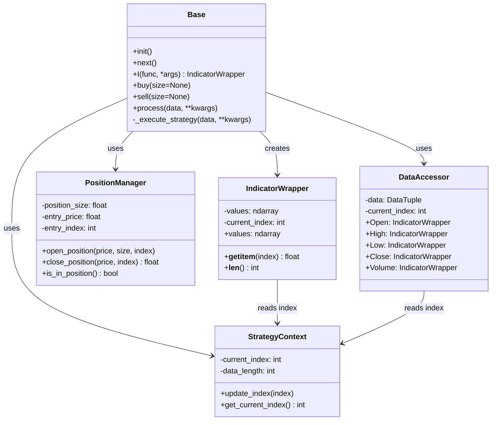

# Design Document: Strategy Base Enhancement

## Overview

This design document outlines the architecture for enhancing the Base strategy class with a backtesting.py-inspired interface. The enhancement replaces the complex `run()` method with simple `init()` and `next()` methods, provides efficient indicator management through pre-calculation and dynamic slicing, implements automatic look-ahead prevention, and includes built-in position management.

The design maintains high performance through efficient data structures and optional numba compatibility while providing an intuitive, clean interface for strategy developers.

## Architecture

The enhanced Base strategy system consists of several key components working together:



## Components and Interfaces

### Base Strategy Class

The enhanced Base class serves as the foundation for all trading strategies:

```python
class Base(ABC):
    def __init__(self):
        self._context = StrategyContext()
        self._position_manager = PositionManager()
        self._indicators = {}
        self.data = None
    
    @abstractmethod
    def init(self):
        """Initialize strategy indicators and parameters."""
        pass
    
    @abstractmethod
    def next(self):
        """Process the current bar."""
        pass
    
    def I(self, func, *args, **kwargs) -> IndicatorWrapper:
        """Register and calculate an indicator."""
        pass
    
    def buy(self, size=None):
        """Open a long position."""
        pass
    
    def sell(self, size=None):
        """Close current position."""
        pass
```

### IndicatorWrapper Class

Provides array-like access to pre-calculated indicator values with automatic look-ahead prevention:

```python
class IndicatorWrapper:
    def __init__(self, values: np.ndarray, context: StrategyContext):
        self._values = values
        self._context = context
    
    def __getitem__(self, index: int) -> float:
        """Access indicator value with negative indexing support."""
        current_idx = self._context.get_current_index()
        if index < 0:
            actual_index = current_idx + index + 1
        else:
            actual_index = index
        
        if actual_index < 0 or actual_index > current_idx:
            raise IndexError("Index out of bounds or accessing future data")
        
        return self._values[actual_index]
    
    @property
    def values(self) -> np.ndarray:
        """Get values up to current index."""
        current_idx = self._context.get_current_index()
        return self._values[:current_idx + 1]
```

### PositionManager Class

Handles position tracking and trade execution:

```python
class PositionManager:
    def __init__(self):
        self.position_size = 0.0
        self.entry_price = 0.0
        self.entry_index = -1
        self.trades = []
    
    def open_position(self, price: float, size: float, index: int):
        """Open a new position."""
        if self.is_in_position():
            raise ValueError("Already in position")
        
        self.position_size = size
        self.entry_price = price
        self.entry_index = index
    
    def close_position(self, price: float, index: int) -> float:
        """Close current position and return the trade return."""
        if not self.is_in_position():
            raise ValueError("No position to close")
        
        trade_return = (price - self.entry_price) / self.entry_price
        self.trades.append(trade_return)
        
        self.position_size = 0.0
        self.entry_price = 0.0
        self.entry_index = -1
        
        return trade_return
    
    def is_in_position(self) -> bool:
        """Check if currently in a position."""
        return self.position_size != 0.0
```

### DataAccessor Class

Provides clean access to market data with automatic slicing:

```python
class DataAccessor:
    def __init__(self, data: DataTuple, context: StrategyContext):
        symbol, timestamps, opens, highs, lows, closes, volume = data
        self._context = context
        
        self.Open = IndicatorWrapper(opens, context)
        self.High = IndicatorWrapper(highs, context)
        self.Low = IndicatorWrapper(lows, context)
        self.Close = IndicatorWrapper(closes, context)
        self.Volume = IndicatorWrapper(volume.astype(float), context)
        self.timestamps = IndicatorWrapper(timestamps.astype(float), context)
```

### StrategyContext Class

Manages the current execution state and prevents look-ahead bias:

```python
class StrategyContext:
    def __init__(self):
        self._current_index = 0
        self._data_length = 0
    
    def update_index(self, index: int):
        """Update the current bar index."""
        if index < 0 or index >= self._data_length:
            raise IndexError(f"Index {index} out of bounds")
        self._current_index = index
    
    def get_current_index(self) -> int:
        """Get the current bar index."""
        return self._current_index
    
    def set_data_length(self, length: int):
        """Set the total data length."""
        self._data_length = length
```

## Data Models

### DataTuple Structure

The system maintains compatibility with the existing DataTuple format:

```python
DataTuple = Tuple[str, np.ndarray, np.ndarray, np.ndarray, np.ndarray, np.ndarray, np.ndarray]
# Format: (symbol, timestamps, opens, highs, lows, closes, volume)
```

### Trade Record

Individual trade information:

```python
@dataclass
class TradeRecord:
    entry_price: float
    exit_price: float
    entry_index: int
    exit_index: int
    return_pct: float
    position_size: float
```

### Strategy Results

Output format matching the existing interface:

```python
@dataclass
class StrategyResults:
    returns: np.ndarray
    equity_curve: np.ndarray
    win_rate: float
    total_trades: int
```

## Error Handling

The system implements comprehensive error handling:

1. **Indicator Registration Errors**: Clear messages when indicator calculation fails
2. **Index Access Errors**: Descriptive errors for invalid array access
3. **Position Management Errors**: Validation for position operations
4. **Look-ahead Prevention**: Automatic prevention of future data access
5. **Parameter Validation**: Input validation for all methods

Example error handling:

```python
def I(self, func, *args, **kwargs) -> IndicatorWrapper:
    try:
        # Calculate indicator values
        values = func(*args, **kwargs)
        if not isinstance(values, np.ndarray):
            raise ValueError(f"Indicator function must return numpy array, got {type(values)}")
        
        if len(values) != self._context._data_length:
            raise ValueError(f"Indicator length {len(values)} doesn't match data length {self._context._data_length}")
        
        return IndicatorWrapper(values, self._context)
    
    except Exception as e:
        raise RuntimeError(f"Failed to register indicator {func.__name__}: {str(e)}")
```

## Testing Strategy

The testing approach combines unit tests for specific functionality and property-based tests for comprehensive validation:

### Unit Testing Focus
- Specific indicator calculations and edge cases
- Position management state transitions
- Error condition handling
- Integration between components

### Property-Based Testing Focus
- Universal properties across all valid inputs
- Data access patterns and look-ahead prevention
- Indicator wrapper behavior consistency
- Strategy execution correctness

### Testing Configuration
- Minimum 100 iterations per property test
- Each property test references design document properties
- Tag format: **Feature: strategy-base-enhancement, Property {number}: {property_text}**
- Use pytest with hypothesis for property-based testing

## Correctness Properties

*A property is a characteristic or behavior that should hold true across all valid executions of a system—essentially, a formal statement about what the system should do. Properties serve as the bridge between human-readable specifications and machine-verifiable correctness guarantees.*

Based on the prework analysis and property reflection to eliminate redundancy, the following properties ensure the correctness of the enhanced Base strategy system:

### Property 1: Strategy Execution Order
*For any* strategy and dataset, the execution engine should call `init()` exactly once before processing any bars, then call `next()` exactly once for each bar in sequential order.
**Validates: Requirements 1.3, 1.4, 8.3**

### Property 2: Indicator Calculation Efficiency
*For any* registered indicator, the calculation function should be called exactly once during registration, and subsequent accesses should return cached values without recalculation.
**Validates: Requirements 2.2, 2.4, 2.5**

### Property 3: Look-ahead Prevention
*For any* data access during strategy execution, the system should never allow access to data beyond the current bar index, ensuring no future information influences current decisions.
**Validates: Requirements 3.1, 3.2, 3.3, 3.5**

### Property 4: Context State Management
*For any* strategy execution, the Strategy_Context should maintain the correct current bar index throughout execution, updating it sequentially for each processed bar.
**Validates: Requirements 3.4, 8.2**

### Property 5: Indicator Array-like Access
*For any* indicator wrapper and valid index, negative indexing should work like Python arrays (with -1 being current bar, -2 being previous bar), and positive indexing should work within the current bounds.
**Validates: Requirements 5.1, 5.2, 5.4, 5.5**

### Property 6: Position State Tracking
*For any* sequence of position operations, the Position_Manager should correctly track position state, record entry/exit data, and calculate returns accurately.
**Validates: Requirements 4.3, 4.4, 4.5**

### Property 7: Data Type Preservation
*For any* input DataTuple, the system should preserve all data types (np.float64 for prices, np.int64 for timestamps and volume) throughout processing.
**Validates: Requirements 7.5**

### Property 8: Return Aggregation Consistency
*For any* strategy execution, the engine should collect all position returns and produce output in the same format as the current process() method: (returns, equity_curve, win_rate, no_of_trades).
**Validates: Requirements 8.4, 8.5**

### Property 9: Error Handling Robustness
*For any* invalid input or operation (invalid indices, missing methods, invalid parameters), the system should raise appropriate, descriptive errors rather than failing silently or producing incorrect results.
**Validates: Requirements 9.2, 9.3**

### Property 10: Indicator Slicing Consistency
*For any* indicator wrapper at any execution point, the sliced data should contain exactly the values from index 0 to the current index, maintaining temporal consistency.
**Validates: Requirements 2.3**