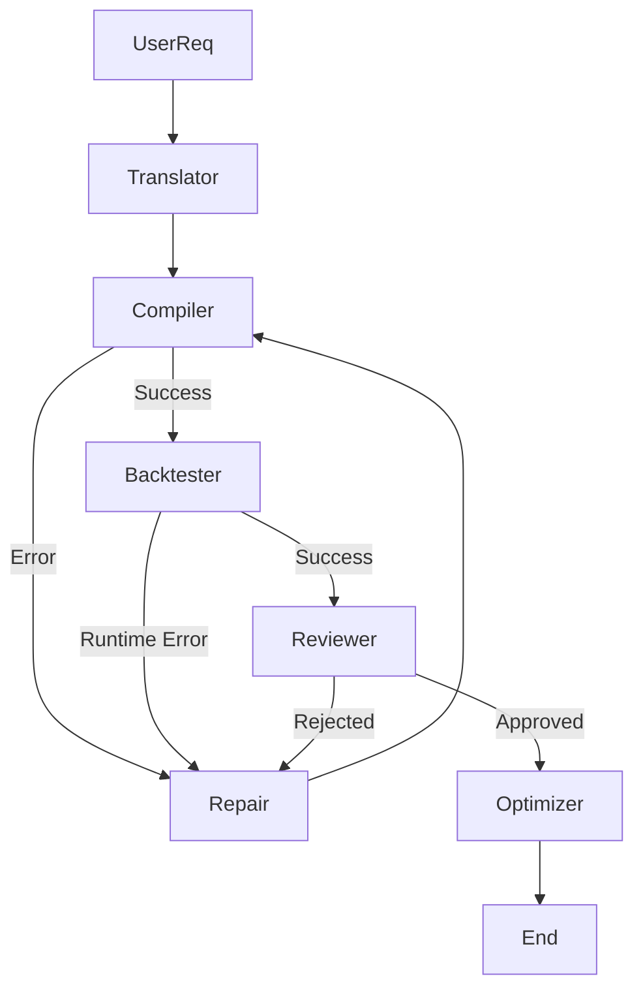

# AGENTS_readme.md

**Welcome, Agent.** This document serves as your primary context source for the `StrategyTestOptimize` project. Read this before modifying the codebase.

> [!NOTE]
> This project requires the **`pygmo_env`** Conda environment. Ensure it is activated before running scripts.

## 1. Project Overview
This project is a **Closed-Loop Research Agent System** responsible for autonomous generation, testing, and optimization of trading strategies. It is built on a layered architecture:
1.  **Execution Engine**: Deterministic, pure Python backtesting and optimization engine.
2.  **Research Layer**: AI-driven agents orchestrated by **LangGraph** to generate and refine strategies.

## 2. Directory Structure

```text
StrategyTestOptimize/
├── data/                   # Historical data storage (CSV)
├── indicators/             # Tech indicators logic (Numba-optimized)
│   ├── risk_metrics.py     # Sharpe, Sortino, Drawdown calcs
│   └── ...
├── research_agent/         # AI Research Layer (The Brain)
│   ├── __init__.py
│   ├── compiler.py         # JSON Spec -> Python Code (Deterministic)
│   ├── graph.py            # LangGraph definition
│   ├── master.py           # CLI Entry point for Agent
│   ├── nodes.py            # Graph Nodes wrappers
│   ├── optimizer.py        # Wrapper around optimize.py
│   ├── repair.py           # Fixing Agent (LangChain)
│   ├── reviewer.py         # Quality Gatekeeper (Hostile)
│   ├── schema.py           # StrategySpec Pydantic Models for JSON
│   ├── state.py            # LangGraph AgentState TypedDict
│   └── translator.py       # Text -> JSON Spec (LangChain)
├── strategies/             # Generated Strategy Files (.py)
│   ├── Base.py             # Abstract Base Class for all strategies
│   └── ...
├── Utilities.py            # Data loading, interval parsing helpers
├── main.py                 # Core Backtesting Logic (CLI/API)
├── optimize.py             # Core Optimization Logic (Pygmo/DE1220)
└── test_api.py             # API Verification Script
```

## 3. The Execution Engine (Deterministic Layer)
This layer operates without LLMs. It is the "Ground Truth".

-   **`main.py`**:
    -   **Function**: `run_backtest(symbols, strategy_name, ...)`
    -   **Multi-processing**: Uses `Pool` for strategy execution on multiple symbols.
    -   **Output**: List of raw metrics (Profit, Win Rate, Sharpe, etc.).

-   **`optimize.py`**:
    -   **Function**: `run_optimization(symbol, strategy, ...)`
    -   **Algorithm**: Uses `pygmo` (Differential Evolution - DE1220).
    -   **Logic**: Walk-Forward Analysis (WFA) to find robust parameters.
    -   **Constraint**: Respects `validate_params()` defined in strategies.

-   **`strategies/Base.py`**:
    -   Interface that all strategies must implement.
    -   Key methods: `run(data, **kwargs)`, `get_optimization_params()`, `validate_params(**kwargs)`.

## 4. The Research Layer (Agentic Layer)
This layer uses LLMs (via LangChain) and orchestration (via LangGraph) to "think" and "code".

### Core Philosophy
1.  **Schema-Driven**: LLMs output strictly structured JSON (`StrategySpec`) defined in `schema.py`.
2.  **Sandboxed Compilation**: `compiler.py` converts JSON to Python. LLMs do *not* write Python directly.
3.  **Hostile Review**: `reviewer.py` aggressively rejects weak strategies (overfitting, few trades).

### Components
-   **Translator (`translator.py`)**: Converts user text (e.g., "RSI mean reversion") into a `StrategySpec` JSON.
-   **Compiler (`compiler.py`)**: Deterministic code generator. logic: `JSON -> Jinja-like Template -> .py file`.
-   **Reviewer (`reviewer.py`)**: Analyzes backtest results. Rejects if:
    -   Win Rate > 95% (suspected lack, lookahead).
    -   Trades < 30 (insufficient sample).
    -   Sharpe < 0.1 (unprofitable).
-   **Repair (`repair.py`)**: The "Self-Healing" mechanism.
    -   Input: Broken Spec + Error Message (Syntax, Runtime, or Review Rejection).
    -   Output: Fixed Spec.
-   **Optimizer (`optimizer.py`)**: If strategy passes review, runs `optimize.py` to tune parameters.

## 5. Orchestration (LangGraph)
The workflow is defined in `research_agent/graph.py`.

### State (`state.py`)
Tracks:
-   `strategy_spec` (The current design)
-   `error` (Last known error)
-   `review_result` (Feedback)
-   `iterations` (Loop counter)

### Workflow


## 6. Usage

### Running the Research Agent
To generate a new strategy:
```bash
# Needs API Key (Google or OpenAI)
python -m research_agent.master "Create a MACD crossover strategy" --symbol SBIN --interval 15 --download
```

### Running the Engine Manually
To backtest a specific generated file:
```bash
python main.py SBIN --strategy MacdCrossover --interval 15
```

To optimize manually:
```bash
python optimize.py SBIN --strategy MacdCrossover --interval 15 --gen 50
```

## 7. Developer Guidelines
-   **Adding Indicators**:
    1.  Update `research_agent/schema.py` (`IndicatorType`).
    2.  Update `research_agent/compiler.py` (Add Numba-optimized logic template).
    3.  Update Prompt in `translator.py`.
-   **Refactoring**:
    -   Ensure `Advisor` / `Repair` agents use the correct schema.
    -   Do typically **not** edit `strategies/*.py` manually; let the Compiler regen them.
