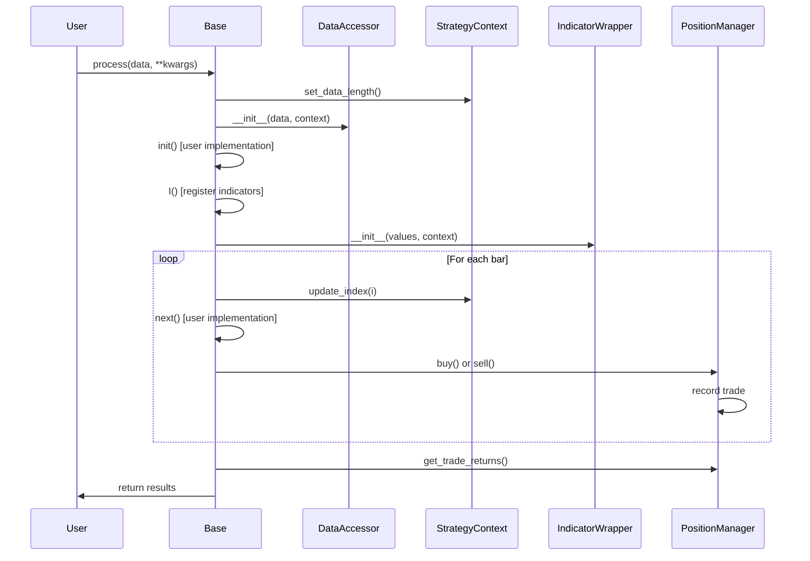
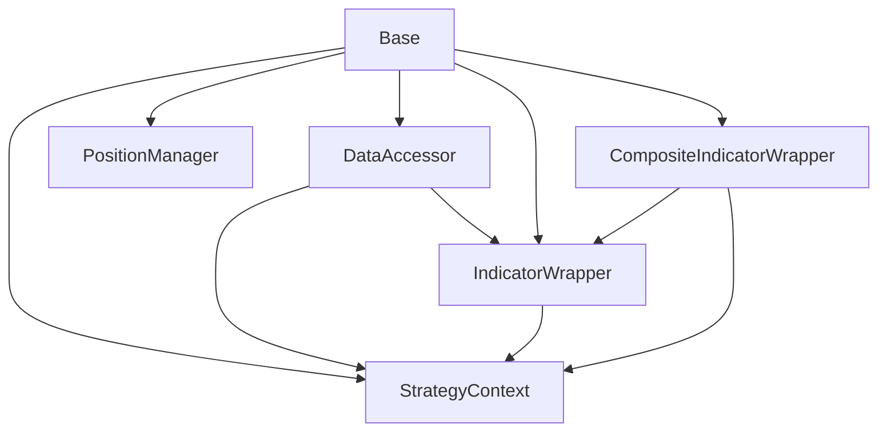

# File Structure and Components

## Overview

This document provides a detailed breakdown of all files and components in the Enhanced Strategy Framework, explaining what each file contains, its purpose, and how components interact.

## Directory Structure

```
strategies/Base/
├── Base.py                 # Main strategy base class
├── IndicatorWrapper.py     # Array-like indicator access with look-ahead prevention
├── CompositeIndicatorWrapper.py  # Multi-component indicator wrapper (in Base.py)
├── PositionManager.py      # Trade and position tracking
├── DataAccessor.py         # Clean OHLCV data interface
└── StrategyContext.py      # Execution state management

docs/
├── README.md               # Main documentation overview
├── strategy-development.md # Complete strategy development guide
├── indicator-system.md     # Indicator usage and patterns
├── api-reference.md        # Complete API documentation
├── migration-guide.md      # Legacy to enhanced migration
├── file-structure.md       # This file - component breakdown
└── examples/               # Strategy examples and patterns
    ├── README.md           # Examples overview
    ├── simple-ma-crossover.py
    ├── rsi-mean-reversion.py
    └── [other examples]
```

## Core Components

### 1. Base.py

**Location:** `strategies/Base/Base.py`  
**Purpose:** Main strategy base class providing the enhanced interface

#### Key Classes

##### `Base` (Abstract Class)
- **Purpose:** Main base class for all trading strategies
- **Key Features:**
  - Clean `init()` and `next()` interface
  - Indicator registration and caching via `I()` method
  - Built-in position management with `buy()` and `sell()`
  - Automatic execution engine
  - Backward compatibility with existing `process()` interface

##### `CompositeIndicatorWrapper`
- **Purpose:** Handles indicators returning multiple arrays (tuples, namedtuples, dicts)
- **Key Features:**
  - Supports named tuple access (`bb.upper`, `bb.lower`)
  - Supports index access (`macd[0]`, `macd[1]`)
  - Supports key access (`stoch['%K']`, `stoch['%D']`)
  - Automatic component wrapping with IndicatorWrapper

##### `StrategyResults` (Dataclass)
- **Purpose:** Structured return format for strategy execution
- **Fields:**
  - `returns`: Individual trade returns array
  - `equity_curve`: Cumulative equity curve
  - `win_rate`: Percentage of winning trades
  - `total_trades`: Total number of completed trades

#### Key Methods

```python
# Abstract methods (must be implemented)
def init(self):                           # Initialize indicators and parameters
def next(self):                           # Process current bar
def validate_params(self, **kwargs):      # Validate strategy parameters
def get_optimization_params(self):        # Define optimization ranges

# Core functionality
def I(self, func, *args, **kwargs):       # Register indicators
def buy(self, size=1.0):                  # Open long position
def sell(self, size=None):                # Close position
def process(self, data, **kwargs):        # Main execution (backward compatible)

# Internal methods
def _execute_strategy(self, data, **kwargs):  # Enhanced execution engine
def _create_indicator_wrapper(self, values, key):  # Single indicator wrapper creation
```

### 2. IndicatorWrapper.py

**Location:** `strategies/Base/IndicatorWrapper.py`  
**Purpose:** Provides array-like access to pre-calculated indicators with look-ahead prevention

#### Key Features

- **Array-like Access:** Supports `indicator[-1]`, `indicator[-2]`, etc.
- **Slice Support:** Supports `indicator[1:10]`, `indicator[-5:]`, etc.
- **Look-ahead Prevention:** Automatically prevents access to future data
- **Bounds Checking:** Validates all index access
- **Type Safety:** Ensures proper data types and error handling

#### Key Methods

```python
def __init__(self, values, context):      # Initialize with values and context
def __getitem__(self, key):               # Array access with int/slice support
def __len__(self):                        # Length up to current index
def values(self):                         # Property: current slice as array copy
```

#### Usage Patterns

```python
# Single value access
current = indicator[-1]                   # Current bar
previous = indicator[-2]                  # Previous bar
first = indicator[0]                      # First bar

# Slice access
last_5 = indicator[-5:]                   # Last 5 bars
range_data = indicator[10:20]             # Specific range
every_other = indicator[::2]              # Every other bar
```

### 3. PositionManager.py

**Location:** `strategies/Base/PositionManager.py`  
**Purpose:** Handles position tracking, trade execution, and return calculation

#### Key Features

- **Position State Tracking:** Maintains current position information
- **Trade Recording:** Automatically records all completed trades
- **Return Calculation:** Calculates trade returns and performance metrics
- **Error Handling:** Validates position operations

#### Key Methods

```python
def __init__(self):                       # Initialize empty position state
def open_position(self, price, size, index):  # Open new position
def close_position(self, price, index):  # Close current position
def is_in_position(self):                 # Check if currently in position
def get_current_position_info(self):      # Get position details
def get_trade_returns(self):              # Get all trade returns
def get_trade_count(self):                # Get total trade count
```

#### Position Information Structure

```python
{
    'is_in_position': bool,               # Whether currently in position
    'position_size': float,               # Size of current position
    'entry_price': float,                 # Entry price of current position
    'entry_index': int                    # Bar index of entry
}
```

### 4. DataAccessor.py

**Location:** `strategies/Base/DataAccessor.py`  
**Purpose:** Provides clean, safe access to OHLCV market data

#### Key Features

- **Clean Interface:** Access data via `self.data.Close`, `self.data.Volume`, etc.
- **Automatic Slicing:** All data automatically sliced to current index
- **Type Preservation:** Maintains proper data types (float64 for prices, int64 for volume/timestamps)
- **Look-ahead Prevention:** Built-in protection against future data access

#### Properties

```python
self.data.Open                            # Opening prices (IndicatorWrapper)
self.data.High                            # High prices (IndicatorWrapper)
self.data.Low                             # Low prices (IndicatorWrapper)
self.data.Close                           # Closing prices (IndicatorWrapper)
self.data.Volume                          # Volume data (IndicatorWrapper)
self.data.timestamps                      # Unix timestamps (IndicatorWrapper)
```

#### Usage Examples

```python
# Current bar data
current_close = self.data.Close[-1]
current_volume = self.data.Volume[-1]
current_timestamp = self.data.timestamps[-1]

# Historical data
prev_high = self.data.High[-2]
last_10_closes = self.data.Close[-10:]
volume_range = self.data.Volume[5:15]
```

### 5. StrategyContext.py

**Location:** `strategies/Base/StrategyContext.py`  
**Purpose:** Manages execution state and prevents look-ahead bias

#### Key Features

- **Index Tracking:** Maintains current bar index throughout execution
- **Bounds Validation:** Ensures index stays within valid range
- **State Management:** Provides consistent state across all components
- **Look-ahead Prevention:** Core mechanism for preventing future data access

#### Key Methods

```python
def __init__(self):                       # Initialize with index=0, length=0
def update_index(self, index):            # Update current bar index
def get_current_index(self):              # Get current bar index
def set_data_length(self, length):        # Set total data length
```

#### Internal State

```python
self._current_index: int                  # Current bar being processed
self._data_length: int                    # Total number of bars in dataset
```

## Component Interactions

### Execution Flow



### Data Flow

```mermaid
graph TD
    A[Raw DataTuple] --> B[DataAccessor]
    B --> C[IndicatorWrapper instances]
    C --> D[Strategy init()]
    D --> E[Indicator Registration]
    E --> F[Pre-calculated Indicators]
    F --> G[Strategy next()]
    G --> H[Position Manager]
    H --> I[Trade Results]
```

### Component Dependencies



## Data Types and Interfaces

### DataTuple Format

```python
DataTuple = Tuple[str, np.ndarray, np.ndarray, np.ndarray, np.ndarray, np.ndarray, np.ndarray]
# Format: (symbol, timestamps, opens, highs, lows, closes, volume)

# Type specifications:
symbol: str                               # Symbol name
timestamps: np.ndarray[np.int64]          # Unix timestamps
opens: np.ndarray[np.float64]             # Opening prices
highs: np.ndarray[np.float64]             # High prices
lows: np.ndarray[np.float64]              # Low prices
closes: np.ndarray[np.float64]            # Closing prices
volume: np.ndarray[np.int64]              # Volume data
```

### Indicator Function Interfaces

#### Simple Indicators

```python
def SMA(data: np.ndarray, period: int) -> np.ndarray:
    """Simple Moving Average - returns single array"""
    pass

def RSI(data: np.ndarray, period: int) -> np.ndarray:
    """RSI - returns single array"""
    pass
```

#### Composite Indicators

```python
# Named tuple return
BBands = namedtuple('BBands', ['middle', 'upper', 'lower'])
def BollingerBands(data: np.ndarray, period: int, std_dev: float) -> BBands:
    """Returns named tuple with three arrays"""
    pass

# Tuple return
def MACD(data: np.ndarray, fast: int, slow: int, signal: int) -> Tuple[np.ndarray, np.ndarray, np.ndarray]:
    """Returns tuple of (macd_line, signal_line, histogram)"""
    pass

# Dictionary return
def Stochastic(high: np.ndarray, low: np.ndarray, close: np.ndarray, k: int, d: int) -> Dict[str, np.ndarray]:
    """Returns dictionary with '%K' and '%D' keys"""
    pass
```

## Performance Characteristics

### Memory Usage

| Component | Memory Impact | Notes |
|-----------|---------------|-------|
| IndicatorWrapper | Low | Stores reference to pre-calculated array |
| CompositeIndicatorWrapper | Medium | Multiple IndicatorWrapper instances |
| PositionManager | Low | Minimal state and trade history |
| DataAccessor | Low | References to original data arrays |
| StrategyContext | Minimal | Two integers only |

### Computational Complexity

| Operation | Complexity | Notes |
|-----------|------------|-------|
| Indicator Registration | O(n) | One-time calculation during init |
| Indicator Access | O(1) | Direct array indexing |
| Slice Access | O(k) | Where k is slice length |
| Position Operations | O(1) | Simple state updates |
| Context Updates | O(1) | Single integer assignment |

### Caching Strategy

- **Indicator Caching:** Based on function name + parameter hash
- **Array Slicing:** Dynamic slicing, no pre-computation
- **Position State:** Minimal state, no caching needed
- **Data Access:** Direct references, no copying until slice access

## Error Handling Strategy

### Error Types by Component

#### Base.py
- `TypeError`: Invalid indicator function or parameters
- `ValueError`: Invalid position operations, parameter validation
- `RuntimeError`: Indicator registration failures

#### IndicatorWrapper.py
- `IndexError`: Invalid array access, look-ahead prevention
- `TypeError`: Invalid index types
- `ValueError`: Empty arrays, invalid initialization

#### PositionManager.py
- `ValueError`: Invalid position operations (open when open, close when closed)

#### DataAccessor.py
- `TypeError`: Invalid DataTuple format
- `ValueError`: Mismatched array lengths

#### StrategyContext.py
- `IndexError`: Index out of bounds
- `ValueError`: Invalid data length

### Error Recovery Patterns

```python
# Graceful error handling in strategies
def next(self):
    try:
        if len(self.sma) < 2:  # Insufficient data
            return
        
        if np.isnan(self.sma[-1]):  # Invalid indicator value
            return
        
        # Strategy logic
        
    except IndexError:
        # Handle index errors gracefully
        return
    except Exception as e:
        # Log but don't crash
        print(f"Strategy error: {e}")
        return
```

This comprehensive file structure documentation provides complete visibility into the Enhanced Strategy Framework's architecture, making it easy to understand, maintain, and extend the system.